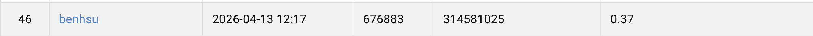

# Visual Recognition using Deep Learning 2026 Spring, Homework 2


Student Name: HSU, PAO-HUA
Student ID: 314581025

## Introduction

This homework includes two Python scripts:
- `data_augmentation.py`: offline augmentation with 1 image -> 3 images.
- `main.py`: two-stage training/validation with optional inference.

## Conda Environment

```bash
conda create -n nycu-cv-hw2 python=3.10 -y
conda activate nycu-cv-hw2
pip install torch torchvision pillow tqdm scipy tensorboard
pip install pycocotools
pip install --user gdown
```

### get the dataset

```bash
gdown https://drive.google.com/uc?id=13JXJ_hIdcloC63sS-vF3wFQLsUP1sMz5
tar -xvf nycu-hw2-data.tar.gz
```

## Build Offline Canvas-Aug Train Set

Generate a new training image folder and a matching COCO json (orig + 1 canvas copy per image):

```bash
./docker/run_dn_detr.sh python src/data_augmentation.py \
  --input-image-dir nycu-hw2-data/train \
  --input-json nycu-hw2-data/train.json \
  --output-image-dir nycu-hw2-data/train_canvas_offline \
  --output-json nycu-hw2-data/train_canvas_offline.json \
  --copies-per-image 2 \
  --canvas-scale-factor 1.1 \
  --random-expand-noise-std 0.04 \
  --overwrite
```

## Train And Predict

If you do not already have a trained checkpoint, use `train` first. You can also train and then automatically run inference in the same command with `--predict-after-train`.

### Train and Predict

```bash
  python src/main.py train \
  --tensorboard \
  --batch-size 32 \
  --epochs 80 \
  --lr 1e-4 \
  --lr-backbone 1e-5 \
  --weight-decay 1e-4 \
  --lr-drop 70 \
  --lr-gamma 0.1 \
  --clip-max-norm 0.1 \
  --ce-loss-coef 2.0 \
  --eos-coef 0.1 \
  --label-smoothing 0.05 \
  --image-size 720 \
  --freeze-transformer \
  --early-stop-patience 10 \
  --num-queries 300 \
  --train-dir nycu-hw2-data/train_canvas_offline \
  --train-json nycu-hw2-data/train_canvas_offline.json \
  --checkpoint-dir checkpoints/detr_canvas_offline \
  --output pred_baseline_canvas_offline.json
```

### Open tensorboard

```bash
tensorboard --logdir tensorboard_baseline/run1 --port 6006
```

## DN-Deformable-DETR-R50

This repo also includes a wrapper that keeps the homework baseline data augmentation policy but swaps the detector to official `DN-Deformable-DETR-R50`.

The DN-DETR setup, Docker image, CUDA 12.8 notes, custom op build steps, and training commands have been moved to [README-DN-DETR.md](/home/ben/nycu_hw/NYCU_VRDL_HW2/README-DN-DETR.md).

### Direct Predict With An Existing Checkpoint

If you already have a trained checkpoint, you can run inference directly:

```bash
python src/main.py predict --checkpoint /home/ben/nycu_hw/NYCU_VRDL_HW2/checkpoints/detr_onPretrain/best.pt --output pred_baseline_onPretrainv2.json --score-threshold 0.1 --amp
```


## Performance Snapshot
